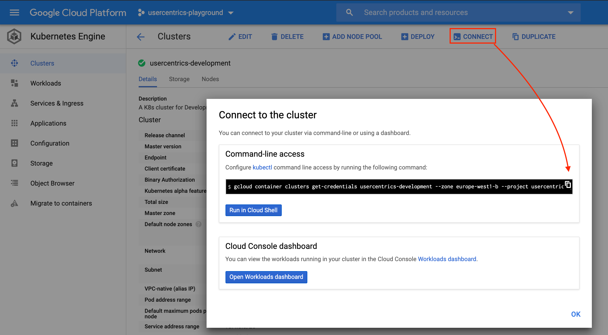

# Releasing with Skaffold

Your app will be deployed to Google Kubernetes Engine. It runs as a docker container, therefore it has to be distributed via the Google Container Registry.

## Using GKE with multiple accounts and clusters
Before we can start using skaffold for releasing an app we have to make sure we work with the right environment and
should avoid consequences of delivering non-production code to PRODUCTION. 

### Google cloud configs
Download and install `gcloud` first. For that please simply follow this [link](https://cloud.google.com/sdk/docs/quickstarts)

#### Listing existing configurations
    
```bash
gcloud config configurations list

NAME     IS_ACTIVE  ACCOUNT                         PROJECT          DEFAULT_ZONE       DEFAULT_REGION
```
This should give you only one line, with a default account.

#### Creating a configuration

```gcloud config configurations create myconf```

This will guide you through the configuration of a new configuration. It allows you to set one config per account, project, cluster…

#### Activating a configuration
```gcloud config configurations activate myconf```

As simple as this to change your account/config.

### Kubernetes cluster contexts
On linux, all kubernetes configs are stored in ~/.kube/config. Each config is used via a context.

#### Listing contexts
```kubectl config get-contexts```

will give you the list of available contexts.

#### Creating a context
```gcloud auth login```

You will probably also need to get your cluster credentials

```gcloud container clusters get-credentials <cluster ID> --zone europe-west1-b --project <project ID>```

or just simple use GCP UI to copy the command line mentioned above:


#### Activating a context
```kubectl config use-context myconf```

### Switching between projects with gcloud configs and kubernetes contexts
Once all the necessary configs and contexts were created, to switch from a cluster to another:

```
gcloud config configurations activate myconf
kubectl config use-context myconf
```

## Securing Secrets with encryption and Google Cloud KMS 
Why do we need such a thing? Sometimes there are values we want to provide to Helm charts that should not be visible to
 the public. So just checking them into version control without encryption is violating security. However, there is always 
a need to give multiple persons access to them, for example all members of a team. You could also store these values as 
environment variables on your deployment cluster, but that is not optimal for multiple people to collaborate, and could 
potentially lead to data loss due to outage.

That’s where helm secrets comes into play. It allows you to encrypt your values, so that they can be checked into version
 control. Furthermore, it offers a way to work with these encrypted values transparently. What’s more, the way the 
 values are encrypted let you see which secrets were changed at what time in your version control system.

### Installing Helm Secrets Plugin
Installing `helm-secrets` is pretty straightforward if you have Helm installed already.
 
```
helm plugin install https://github.com/zendesk/helm-secrets

Updating Homebrew...
==> Auto-updated Homebrew!
Updated 2 taps (homebrew/core and homebrew/cask).
==> Updated Formulae
bazel                      grin                       nnn
circleci                   jena                       topgrade
deno                       lazygit                    traefik
fastlane                   libcec                     vapor
fuseki                     mysql-connector-c++        vim
==> Updated Casks
cctalk              kui                 mysqlworkbench      strawberry
cellery             lbry                postman             texpad
dozer               melodics            prepros             timeular
jami                microsoft-edge      protopie            zenmate-vpn
knime               mps                 stoplight-studio

==> Downloading https://homebrew.bintray.com/bottles/sops-3.5.0_1.catalina.bottl
==> Downloading from https://d29vzk4ow07wi7.cloudfront.net/55e5624ed3a1c5ccd2113
######################################################################## 100.0%
==> Pouring sops-3.5.0_1.catalina.bottle.tar.gz
🍺  /usr/local/Cellar/sops/3.5.0_1: 7 files, 27.9MB
Installed plugin: secrets
```

Everything that is required will be installed, including sops and the helm-wrapper. For some operating systems it might 
be necessary to install sops manually. For further information, refer to the helm-secrets [readme](https://github.com/zendesk/helm-secrets).

### How to work with secrets files
We will be using the Google Cloud KMS for encrypting secrets. This allows as to proper manage access to the keys via GCP IAM.
Before starting with encryption please make sure you acquired new user credentials to use for Application Default Credentials:

```
gcloud auth application-default login
```

After this you could start with encrypting your secrets.

#### Specify encryption keys
Create `.sops.yaml` with KMS key inside. It is needed for the initial encryption, afterwards the encrypted file will contain needed sops metadata.
   
```
---
creation_rules:
 - gcp_kms: projects/<PROJECT_ID>/locations/<LOCATION>/keyRings/<KEY_RIND>/cryptoKeys/<KEY>
```
   
**NOTE:** starting from SOPS v.2.0.x there was a regression which seems doesn’t allow anymore to search recursively 
upwards in the directory hierarchy until it finds a `.sops.yaml` file. Therefor please put your `.sops.yaml` alongside 
the secret and call helm secrets enc from that directory.

#### Encrypt your secret values 
    
```
cd helm-chart/helm-vars/dev
helm secrets enc secrets.yaml

Encrypting secrets.yaml
Encrypted secrets.yaml
```

Make sure you adjusted `skaffold.yml` by adding `useHelmSecrets: true` parameter to `deploy` block.

**Congratulations!** Now you are able to safely deliver your app to the right cluster.

## Deploy to cluster with Skaffold 
Skaffold is a tool created by Google that helps with continuous development and deployment of Kubernetes applications specifically aimed at developers.
What it does is the next:

* Creates Kubernetes configuration files for your apps
* Deploys your application to a local or remote cluster
* Monitors your source code and automatically re-deploys when needed
* Steams logs from your deployed pods to your local terminal

But Skaffold also offers several advanced features on top of this basic functionality. First of all, Skaffold provides an extensible pluggable architecture, allowing developers to choose the appropriate tools for each step involved in building and deploying their application. Skaffold also attempts to provide portability for CI integrations among different build systems, image registries, and deployment tools.

**NOTE:** Please check with `helm` documentation on how to prepare a release chart for skaffold deployments. Here and further it is considerd 
that an application is packed with `helm`.

### Deploying to a remote cluster
Before continuing, ensure `kubectl` is pointing to the correct cluster. For this you could check nodes or pods to make 
 sure you are on the right cluster.:
 
```
kubectl get nodes

NAME     STATUS   ROLES    AGE     VERSION
```

When deploying to a remote cluster you have to point Skaffold to your default image repository in one of the four ways:

1. flag: `skaffold run --default-repo gcr.io/<PROJECT_ID>`
2. env var: `SKAFFOLD_DEFAULT_REPO=gcr.io/<PROJECT_ID> skaffold dev`
3. global skaffold config (one time): `skaffold config set --global default-repo gcr.io/<PROJECT_ID>`
4. skaffold config for current kubectl context: `skaffold config set default-repo gcr.io/<PROJECT_ID>`

### Deploying for specific environment
Skaffold profiles allow you to define build, test and deployment configurations for different contexts. Different contexts are typically different environments in your app’s lifecycle, like Production or Development.

You can create profiles in the `profiles` section of `skaffold.yaml`.

```skaffold run --profile=prod --default-repo gcr.io/<PROJECT_ID>```

#### Using `render-only` flag
With this flag you could validate rendered Kubernetes manifests before deploying 

```skaffold run --render-only --profile=prod --default-repo gcr.io/<PROJECT_ID>```
