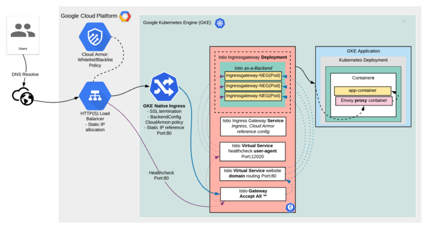
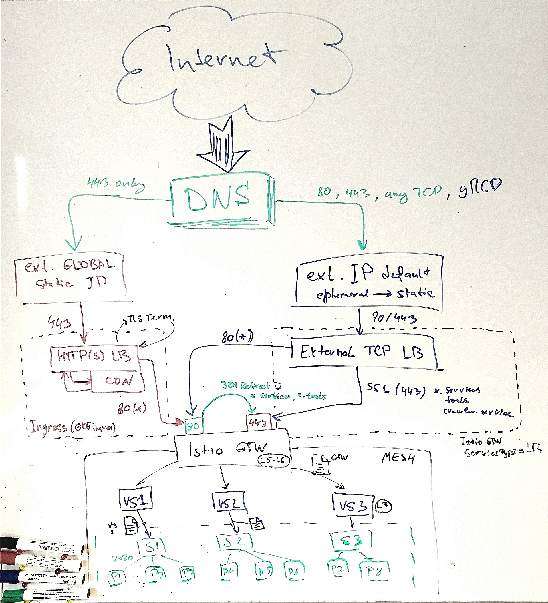
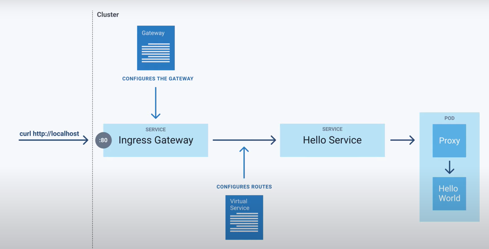

# Istio Service Mesh
**What is Istio?**
Istio is an open service mesh that provides a uniform way to connect, manage, and secure microservices. It supports 
managing traffic flows between services, enforcing access policies, and aggregating telemetry data, all without requiring 
changes to the microservice code.

Istio gives you:

- Automatic load balancing for HTTP, gRPC, WebSocket, MongoDB, and TCP traffic.
- Fine-grained control of traffic behavior with rich routing rules, retries, failovers, and fault injection.
- A configurable policy layer and API supporting access controls, rate limits, and quotas.
- Automatic metrics, logs, and traces for all traffic within a cluster, including cluster ingress, and egress.
- Secure service-to-service communication in a cluster with strong identity based authentication and authorization.

## HTTP(S) LoadBalancer GKE Ingress + Istio (NEG) + SSL Manager Integration + Cloud CDN
In this tutorial we will use two similarly named and related concepts.

 - **_Istio ingress gateway_**: defines rules for routing external HTTP/TCP traffic to services in a Kubernetes cluster. 
    The Istio ingress gateway is implemented as a Kubernetes Service and a Kubernetes Deployment.
 - **_Kubernetes Ingress_**: defines rules for routing external HTTP(S) traffic to one or more Kubernetes Services in a cluster. 
    When you create a Kubernetes Ingress object in a GKE cluster, GKE provisions the resources required for HTTP(S) Load Balancing.

In this tutorial, we use a Kubernetes Ingress resource to route external traffic to the Istio ingress gateway. 
The Istio ingress gateway then routes traffic to services in the cluster.

This integration will enable such a setup to have:
- Full SSL termination at GCE Loadbalancer (not Istio Ingress Gateway)
- Anycast IP (GLOBAL static IP)
- Full Istio Mesh features integration, packet routing, traffic control, release management
- Cloud Armor support, DDoS protection + WAF features
- Cloud Identity Aware Proxy
- And more [Backend](https://cloud.google.com/kubernetes-engine/docs/concepts/backendconfig) features

This requires provisioning HTTP(s) load balancer and configuring Istio to accept traffic via GKE (gce) Ingress, with the associated BackendConfig
Besides CloudArmor feature, there are other additional benefits as you can use a BackendConfig to configure these features of HTTP(S) Load Balancing:
- Cloud CDN
- Identity-Aware Proxy (IAP)
- Timeout, Connection draining timeout, Session affinity

This is different from the default Istio Service mesh model implementation, where the latter is provisioned with servicetype instead of a traditional ingress.



## Objectives
- Reserve static IP / Change to static by default created ephemeral IP for default LB
- Create a DNS record for wildcard domain, e.g. "_*.services.usercentrics.eu_".
- Update to Istio 1.6 with Istio Operator Installed.
- Use Cert Manager to issue a certificate.
- Create an Istio virtual service to handle health check requests.
- Configure HTTP(S) Load Balancing by creating a Kubernetes Ingress object.
- Deploy a default Istio Gateway to route requests to VirtualServices

### Reserve Static IP (for CDN enabled LB)
In order to serve a production workflow please do the following:
- Reserve a global static external IP address and use it as the public IP address of the GKE Ingress with CDN enabled.
- Create a DNS A record for your domain name and set its value to the public IP address of the GKE Ingress object. 
- Configure the GKE Ingress object to use HTTPS

*Note:* for non-CDN use you change default ephemeral IP address (created by external LB creation) to static.   

### Cert Manager
It’s advised you read the [Cert Manager](../cert-manager/README.md) page first for a more general understanding of how 
cert-manager is installed and configured.

#### Options for providing SSL certificates
There are three ways to provide SSL certificates to an HTTP(S) load balancer:

*Google-managed certificates*

Google-managed SSL certificates are provisioned, deployed, renewed, and managed for your domains. Managed certificates 
do not support wildcard domains.

*Self-managed certificates shared with Google Cloud*

You can provision your own SSL certificate and create a certificate resource in your Google Cloud project. You can then 
list the certificate resource in an annotation on an Ingress to create an HTTP(S) load balancer that uses the certificate. 
Refer to [instructions for pre-shared certificates](https://cloud.google.com/kubernetes-engine/docs/how-to/ingress-multi-ssl#using_pre-shared_certificates) for more information.

```
apiVersion: networking.k8s.io/v1beta1
kind: Ingress
metadata:
  name: istio-ingress-uc-eu
  namespace: istio-system
  annotations:
    ingress.gcp.kubernetes.io/pre-shared-cert: usercentrics-eu
```

*Self-managed certificates as Secret resources*

You can provision your own SSL certificate and create a Secret to hold it. You can then refer to the Secret in an Ingress 
specification to create an HTTP(S) load balancer that uses the certificate. Refer to the instructions for using certificates 
in Secrets for more information.

#### Upload certificates manually directly to GKE
Kubernetes store the certificate in the secret. You can simply export the secret and import it on to new kubernetes cluster.
Here is one example to export the secret locally:

`kubectl get secret my-secret-name(secret name) --export -o yaml > my-secret-name.yaml`

my-secret-name.yaml file will be created

now on the new cluster, you can simply import the certificate using generated yaml file

`kubectl apply -f my-secret-name.yaml -n istio-system`

(if want to set in a specific namespace)

After importing the certificate you can simply use them in *ingress*.

## Updating to Istio 1.6 with Istio Operator Installed
**NOTE:** It is important that you use the latest GKE version above 1.17 where Istio 1.6 Operator installed already.

1. Turn down the old control plane of Istio (https://cloud.google.com/istio/docs/istio-on-gke/upgrade-with-operator#turn_down_the_old_control_plane)
~~2. Disable Istio Add-on on the cluster (this will keep Installed CP)~~
3. Install istioctl (always match version to the installed Istio version))
4. Make a copy of IstioOperator CR

```
kubectl get istiooperators -n istio-system ISTIO_VERSION -o yaml > istio_operator.yaml
```

### Verifying Installation
Ensure the following Kubernetes services deployed: istio-citadel, istio-pilot, istio-ingressgateway, istio-policy, 
istio-sidecar-injector, and istio-telemetry (you'll also see the other deployed services):

```kubectl get service -n istio-system```

Ensure the corresponding Kubernetes Pods are deployed and all containers are up and running: istio-pilot-*, istio-policy-*, 
istio-telemetry-*, istio-ingressgateway-*, istio-sidecar-injector-*, and istio-citadel-*.

```kubectl get pods -n istio-system```

## Step by step guide after Istio has been installed
Before you can start using Istio Service Mesh you have to configure:

* a) Istio Gateway
* b) Create and apply Backend configuration for Istio Ingress
* c) Introduce VirtualService for LB Health Check for HTTP(S) LB



### Istio Ingress Gateway Backend configuration
Istio Ingress Gateway will be served as backend service for HTTP(S) LoadBalancer with CDN enabled in parallel with 
default external load balancer In order to control backend timeout as well as connection draining timeout we could create 
a backend configuration, which will be transferred then to GCE NEG backend groups.

```kubectl apply -f <ENV>/istio-ingress-gtw-backend.yml```

and then apply this backend config for Istio Ingress Gateway service

```kubectl annotate svc istio-ingressgateway -n istio-system cloud.google.com/backend-config='{"ports": {"80":"istio-ingress-backendconfig"}}'```

### Creating Istio Gateway
`Gateway` describes a load balancer operating at the edge of the mesh receiving incoming or outgoing HTTP/TCP connections. 
A VirtualService can then be bound to a gateway to control the forwarding of traffic arriving at a particular host or gateway port.

```kubectl apply -f <ENV>/istio-gtw.yml```



### Handling health check requests
Creating an Istio virtual service allows the cluster to respond to load-balancing health check requests by forwarding
 the requests to the status endpoint on the Istio Ingress Gateway. Without this HTTP(S) LoadBalancer would never be healthy, 
 and thus no traffic forwarded to the backend — Istio Ingress Gateway as our NEGs:
 
```kubectl apply -f <ENV>/istio-health-vs.yml```

**NOTE:** before applying please check if the Istio Ingressgateway service has got 15021 starting from Istio v1.6.x port for status check.

### Istio Ingress SSL Policy Configuration
Istio Ingress could be configured with certain SSL policy. Because Istio Ingress object will init creation of the HTTP(S) LoadBalancer, it
is possible to configure a frontend for it with exact SSL policy. For this we have, first, create or update a relevant SSL policy in GCP

```gcloud compute ssl-policies create <POLICY NAME> --profile RESTRICTED --min-tls-version 1.2```

and then add a frontend configuration with specified SSL policy name as defined above

```kubectl apply -f <ENV>/istio-ingress-gtw-frontend.yml```


### Creating Istio Ingress
Last step is to create an Istio Ingress Object to forward traffic (with SSL termination) from GCE LoadBalancer to Istio 
Gateway which will forward then request to VirtualService which will route Domain request to the dedicated app service.

```kubectl apply -f <ENV>/ingress.yml```

**NOTE:** be patient with ingress creating GCLB for you. It could take up to 15 minutes!

### Enabling Istio’s sidecar injection
To take full advantage of Istio's features, each service in your application needs to have an Envoy sidecar proxy 
running in its Pod. The Envoy proxy intercepts all inbound and outbound traffic to the service and communicates with 
the Istio control plane. You can inject an Envoy proxy manually by updating your Pods' Kubernetes configuration, or you 
can use Istio's webhooks-based automatic sidecar injection.

**Note:** Please create namespace(s) in advance!

- Find the exact Istio 1.6 version number:

`kubectl -n istio-system get pods -lapp=istiod --show-labels`

The output of the command is similar to the following:

```
NAME                                READY   STATUS    RESTARTS   AGE   LABELS
istiod-istio-163-5fccfcf4dd-2p9c8   1/1     Running   0          22h   app=istiod,istio.io/rev=istio-164,istio=istiod,pod-template-hash=5fccfcf4dd
```

In this example, the version is: *istio-164*
    
- Re-label the namespace containing the workloads that you want to roll over to 1.6. The version label has to match the version of the control plane. In the following command, replace VERSION with the version from the previous command, for example: istio-163

`kubectl label namespace NAMESPACE istio-injection- istio.io/rev=VERSION --overwrite`

- Perform a rolling restart of the selected workloads:

`kubectl rollout restart deployment DEPLOYMENT -n NAMESPACE`

- List the pods in the namespace:

`kubectl get pods -n NAMESPACE`

- Select one of the pods to check that the workloads have been injected with the 1.6 version of the sidecar proxy:

`kubectl describe pod -n NAMESPACE YOUR_SELECTED_POD`

The output should show the proxy container at the 1.6 version, for example:

```
...
istio-proxy:
  Container ID:  docker://22f62020ddcc6f8e02d800b5614e02aae2d082ce991c9e3eab9846d9f2cf90f5
  Image:         gcr.io/gke-release/istio/proxyv2:1.6.4-gke.0
...
```

## Troubleshooting

### Verify no error logs in Envoy proxies
Review the logs for the proxy in question, searching for error message instances:

`kubectl -n YOUR_NAMESPACE logs YOUR_POD_NAME -c istio-proxy`

However, ignore the warning messages like the following, which are normal:

```
[warning][filter] [src/envoy/http/authn/http_filter_factory.cc:83]
mTLS PERMISSIVE mode is used, connection can be either plaintext or TLS,
and client cert can be omitted. Please consider to upgrade to mTLS STRICT mode
for more secure configuration that only allows TLS connection with client cert.
See https://istio.io/docs/tasks/security/mtls-migration/ [warning][config]
[bazel-out/k8-opt/bin/external/envoy/source/common/config/_virtual_includes/grpc_stream_lib/common/config/grpc_stream.h:91]
gRPC config stream closed: 13
```

[TLS connection failures after Istio 1.3 upgrade](https://github.com/istio/istio/issues/17139)

### Kiali Auth strategy is reset to login by Istio CR reconcile

To make this setting be consistent and have token as default, please change Istio Operator by adding next settings in valuse:

```
  ...
  values:
    kiali:
      dashboard:
        auth:
          strategy: token
  ... 
```